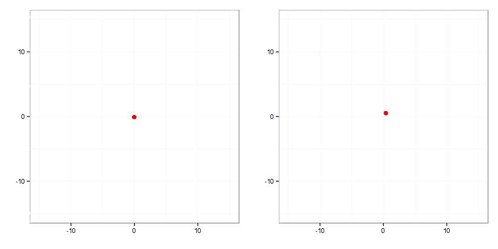
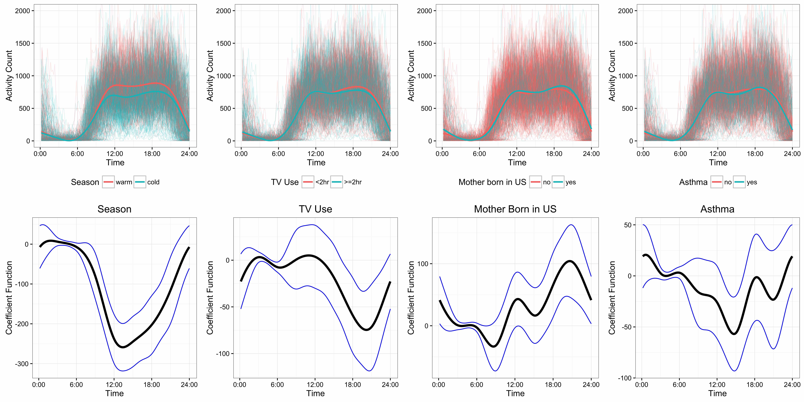

---
---

<link rel="stylesheet" href="styles.css" type="text/css" />
<link rel="stylesheet" href="academicons/css/academicons.min.css"/>

 

I am inspired by current scientific questions to develop general, principled methods for the analysis of challenging data sets. The methodological developments motivated by these studies are modern functional data analysis tools required by emerging structures and scientific problems.

Below are a few images stemming from my recent work.

## Motion kinematics

I'm interested in understanding the effect of stroke on motion integrity. In a sequence of experiments, subjects were asked to reach toward eight targets in a two-dimensional planar motion task. Below we show motions made by two subjects, each of whom suffers from mild stroke affecting their dominant arm. 

Our work has studied the effect of stroke on the mean and variability of these motions; the methods have also been applied to several other contexts, including motor learing in healthy subjects. This [interactive graphic](https://jeff-goldsmith.shinyapps.io/MotorControl_Interactive/) shows the effect of covariates on the mean of kinematic motions.

## Wearable devices

Accelerometry is used to collect continuous information on physical activity using unobtrusive monitors worn at all times. Below is data gathered for 420 children in northern Manhattan and the Bronx, collected as part of a study to understand the effects of environmental exposures on health. In several papers we've tried to understand the effects of subject characteristics, such as age, gender, or BMI, on activity profile, as well as to assess associations between physical activity and long-term health outcomes. 

This graphic shows observed accelerometer data for children in this study, separated into groups based on covariates. Below each data plot is the coefficient function for the covariate effect estimated in a function-on-scalar regression model. An [interactive version](https://jeff-goldsmith.shinyapps.io/HS_interactive/) of this graphic is also available.

